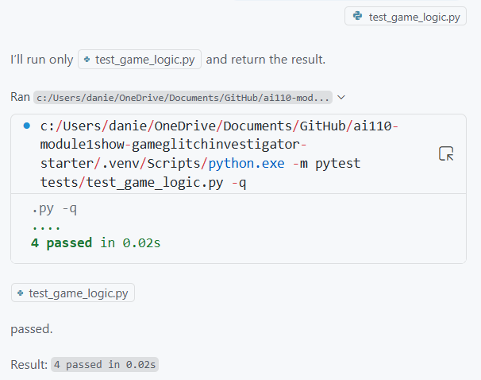
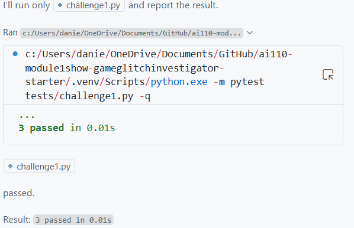
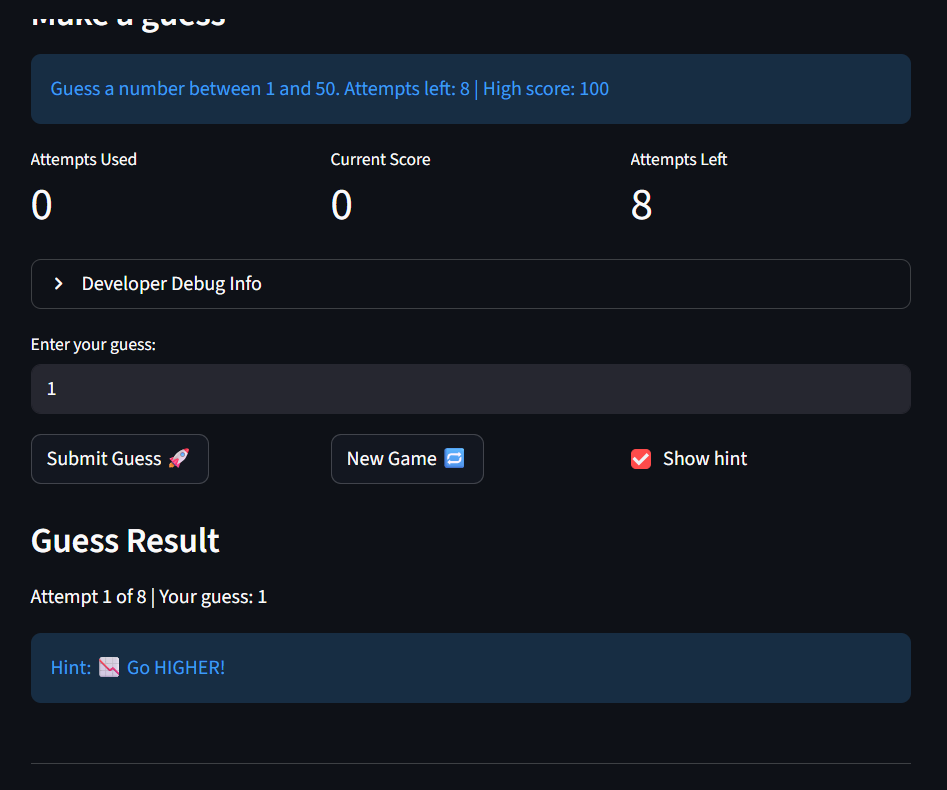
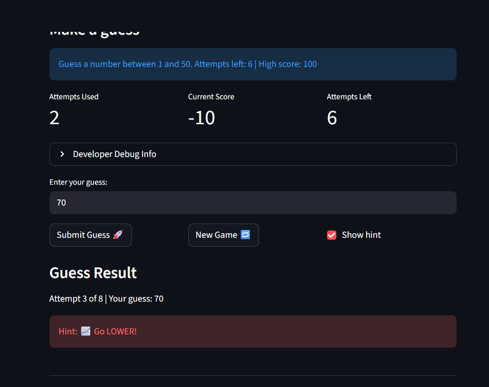

# 🎮 Game Glitch Investigator: The Impossible Guesser

## 🚨 The Situation

You asked an AI to build a simple "Number Guessing Game" using Streamlit.
It wrote the code, ran away, and now the game is unplayable. 

- You can't win.
- The hints lie to you.
- The secret number seems to have commitment issues.

## 🛠️ Setup

1. Install dependencies: `pip install -r requirements.txt`
2. Run the broken app: `python -m streamlit run app.py`

## 🕵️‍♂️ Your Mission

1. **Play the game.** Open the "Developer Debug Info" tab in the app to see the secret number. Try to win.
2. **Find the State Bug.** Why does the secret number change every time you click "Submit"? Ask ChatGPT: *"How do I keep a variable from resetting in Streamlit when I click a button?"*
3. **Fix the Logic.** The hints ("Higher/Lower") are wrong. Fix them.
4. **Refactor & Test.** - Move the logic into `logic_utils.py`.
   - Run `pytest` in your terminal.
   - Keep fixing until all tests pass!

## 📝 Document Your Experience

- This is a basic guessing game where the user guesses a value between two numbers depending on the difficulty in a specific number of guesses.
- Some of the bugs I found were that the UI was essentially hard coded (no matter what I chose it always 1 to 100) and that the range for the secret number was always between 1 to 100 even if I chose easy as my difficulty.
- I changed the hard coded values to {low} and {high} and made sure the secret number was within the actual range chose by the difficulty. 

##  Demo

- [] [Insert a screenshot of your fixed, winning game here]

## 🚀 Stretch Features

- [] [If you choose to complete Challenge 1, insert a screenshot of your Enhanced Game UI here]
- I added the High Score feature using CoPilot AI since this allows users to see how well they've done when guessing numbers. CoPilot began by looking into all previous game files, then deciding wehre to add them. It then patched the files to have this bug and even made a test that checked specifically for this.
- [
] [If you choose to complete Challenge 4, insert a screenshot of your Enhanced Game UI here]
